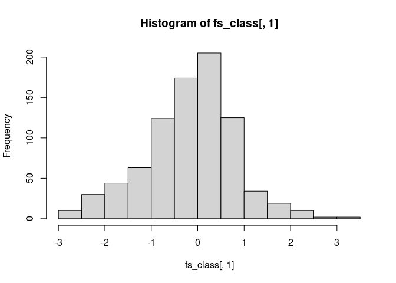
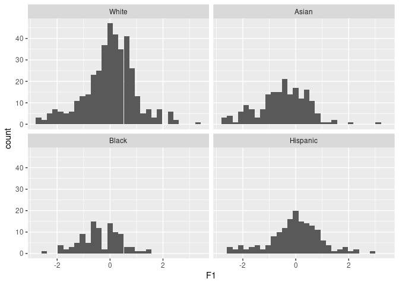
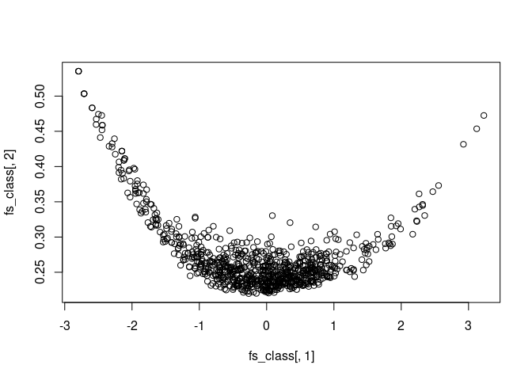
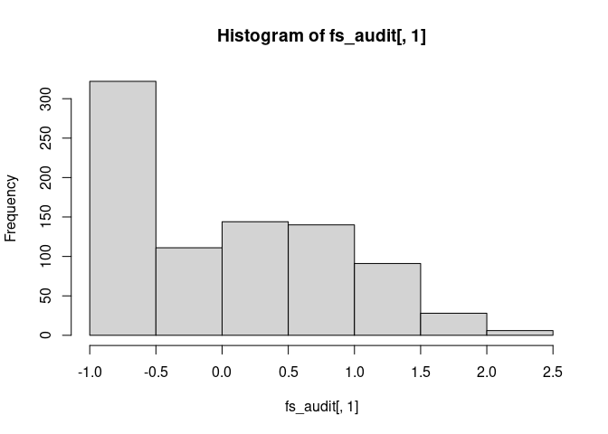
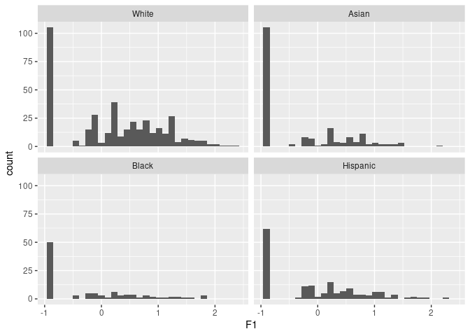
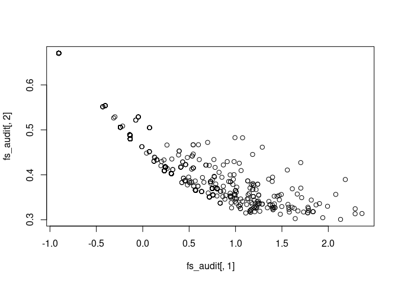
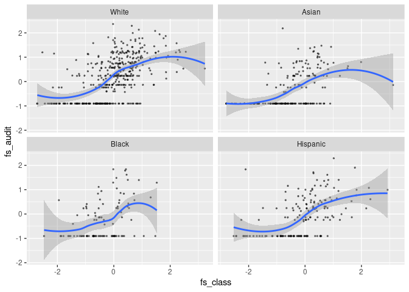
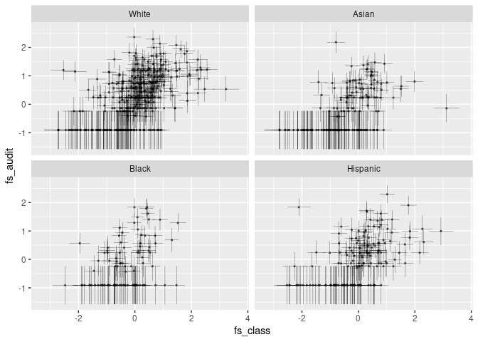

# Example 1


- [CLASS (College Life Alcohol Salience
  Scale)](#class-college-life-alcohol-salience-scale)
  - [Obtain factor scores](#obtain-factor-scores)
- [AUDIT (Alcohol Use Disorders Identification
  Test)](#audit-alcohol-use-disorders-identification-test)
  - [Obtain factor scores](#obtain-factor-scores-1)
- [Combine factor scores](#combine-factor-scores)
- [Factor Score Regression](#factor-score-regression)
- [Joint Modeling with WLS](#joint-modeling-with-wls)
- [Two-Stage Path Analysis](#two-stage-path-analysis)
- [Drinkers Only](#drinkers-only)

``` r
library(haven)
library(dplyr)
library(ggplot2)
library(mirt)
library(umx)
# install.packages("remotes")
# remotes::install_github("Gengrui-Zhang/R2spa")
library(R2spa)
```

Import data

``` r
lui2019_dat <- haven::read_sav("https://osf.io/download/wxjsg/")
dat <- lui2019_dat |>
    filter(if_all(c(class14, audit1:audit3), ~ !is.na(.))) |>
    filter(eth %in% 1:4) |>
    mutate(across(c(class1:class15, audit1:audit10), as.numeric)) |>
    mutate(
        campuslive = as_factor(campuslive),
        eth = factor(eth,
            levels = 1:4,
            labels = c("White", "Asian", "Black", "Hispanic")
        )
    ) |>
    arrange(eth)
```

## CLASS (College Life Alcohol Salience Scale)

``` r
m1c <- mirt::multipleGroup(
    dat[, paste0("class", 1:15)],
    group = dat$eth,
    invariance = c(
        "free_mean", "free_var",
        "intercepts", "slopes"
    ),
    verbose = FALSE
)
DIF(m1c,
    which.par = c("a1"),
    scheme = "drop"
)
DIF(m1c,
    which.par = c("d1", "d2", "d3", "d4"),
    scheme = "drop"
)
DIF(m1c,
    which.par = c("a1", "d1", "d2", "d3", "d4"),
    scheme = "drop"
)
```

``` r
# Free intercepts for item 14
m2c <- mirt::multipleGroup(
    dat[, paste0("class", 1:15)],
    group = dat$eth,
    invariance = c(
        paste0("class", c(1:13, 15)),
        "slopes", "free_mean", "free_var"
    ),
    verbose = FALSE
)
coef(m2c, simplify = TRUE)
```

    $White
    $items
                a1     d1     d2     d3     d4
    class1   2.115  3.609  2.352  1.147 -1.631
    class2   2.348  1.921  0.573 -0.919 -3.377
    class3  -0.950  2.172  0.965 -1.039 -2.345
    class4   2.517  1.440 -0.196 -1.745 -4.424
    class5   1.738  0.869 -0.574 -1.846 -4.092
    class6   1.698 -0.131 -1.686 -3.222 -5.307
    class7   2.393  2.792  1.411  0.304 -2.511
    class8  -1.080  2.041  0.399 -0.791 -2.174
    class9   1.342  2.271  0.921 -0.264 -2.725
    class10  1.576  1.636  0.184 -0.917 -3.343
    class11  2.101  3.500  1.726  0.124 -3.271
    class12  1.953  2.574  1.229 -0.562 -3.079
    class13  1.840  0.546 -0.881 -1.967 -4.492
    class14  1.718  3.368  2.311  0.473 -2.091
    class15  1.839  1.071 -0.161 -1.363 -3.506

    $means
    F1 
     0 

    $cov
       F1
    F1  1


    $Asian
    $items
                a1     d1     d2     d3     d4
    class1   2.115  3.609  2.352  1.147 -1.631
    class2   2.348  1.921  0.573 -0.919 -3.377
    class3  -0.950  2.172  0.965 -1.039 -2.345
    class4   2.517  1.440 -0.196 -1.745 -4.424
    class5   1.738  0.869 -0.574 -1.846 -4.092
    class6   1.698 -0.131 -1.686 -3.222 -5.307
    class7   2.393  2.792  1.411  0.304 -2.511
    class8  -1.080  2.041  0.399 -0.791 -2.174
    class9   1.342  2.271  0.921 -0.264 -2.725
    class10  1.576  1.636  0.184 -0.917 -3.343
    class11  2.101  3.500  1.726  0.124 -3.271
    class12  1.953  2.574  1.229 -0.562 -3.079
    class13  1.840  0.546 -0.881 -1.967 -4.492
    class14  1.718  2.371  1.244 -0.103 -2.060
    class15  1.839  1.071 -0.161 -1.363 -3.506

    $means
        F1 
    -0.498 

    $cov
          F1
    F1 1.001


    $Black
    $items
                a1     d1     d2     d3     d4
    class1   2.115  3.609  2.352  1.147 -1.631
    class2   2.348  1.921  0.573 -0.919 -3.377
    class3  -0.950  2.172  0.965 -1.039 -2.345
    class4   2.517  1.440 -0.196 -1.745 -4.424
    class5   1.738  0.869 -0.574 -1.846 -4.092
    class6   1.698 -0.131 -1.686 -3.222 -5.307
    class7   2.393  2.792  1.411  0.304 -2.511
    class8  -1.080  2.041  0.399 -0.791 -2.174
    class9   1.342  2.271  0.921 -0.264 -2.725
    class10  1.576  1.636  0.184 -0.917 -3.343
    class11  2.101  3.500  1.726  0.124 -3.271
    class12  1.953  2.574  1.229 -0.562 -3.079
    class13  1.840  0.546 -0.881 -1.967 -4.492
    class14  1.718  2.270  1.357  0.051 -1.870
    class15  1.839  1.071 -0.161 -1.363 -3.506

    $means
        F1 
    -0.355 

    $cov
         F1
    F1 0.66


    $Hispanic
    $items
                a1     d1     d2     d3     d4
    class1   2.115  3.609  2.352  1.147 -1.631
    class2   2.348  1.921  0.573 -0.919 -3.377
    class3  -0.950  2.172  0.965 -1.039 -2.345
    class4   2.517  1.440 -0.196 -1.745 -4.424
    class5   1.738  0.869 -0.574 -1.846 -4.092
    class6   1.698 -0.131 -1.686 -3.222 -5.307
    class7   2.393  2.792  1.411  0.304 -2.511
    class8  -1.080  2.041  0.399 -0.791 -2.174
    class9   1.342  2.271  0.921 -0.264 -2.725
    class10  1.576  1.636  0.184 -0.917 -3.343
    class11  2.101  3.500  1.726  0.124 -3.271
    class12  1.953  2.574  1.229 -0.562 -3.079
    class13  1.840  0.546 -0.881 -1.967 -4.492
    class14  1.718  2.829  1.514  0.086 -2.455
    class15  1.839  1.071 -0.161 -1.363 -3.506

    $means
        F1 
    -0.036 

    $cov
         F1
    F1 1.04

This is consistent with Lui (2019)

### Obtain factor scores

``` r
fs_class <- fscores(m2c, full.scores.SE = TRUE)
head(fs_class)
```

             F1     SE_F1
    1 0.8288844 0.2485860
    2 1.8604946 0.3005690
    3 0.9436835 0.3041293
    4 0.6088156 0.2521170
    5 0.8309929 0.2516309
    6 0.6620432 0.2493182

``` r
# Distribution of factor scores
hist(fs_class[, 1])
```



``` r
# By ethnicity
ggplot(data = data.frame(fs_class), aes(x = F1)) +
    geom_histogram() +
    facet_wrap(~ dat$eth)
```

    `stat_bin()` using `bins = 30`. Pick better value with `binwidth`.



``` r
# Relationship between factor scores and standard errors
plot(fs_class[, 1], fs_class[, 2])
```



## AUDIT (Alcohol Use Disorders Identification Test)

- 7 items on negative alcohol-related consequences

``` r
# AUDIT
m1a <- mirt(dat[, paste0("audit", 4:10)], verbose = FALSE)
```

    "audit9" re-mapped to ensure all categories have a distance of 1

    "audit10" re-mapped to ensure all categories have a distance of 1

### Obtain factor scores

``` r
fs_audit <- fscores(m1a, full.scores.SE = TRUE)
head(fs_audit)
```

                 F1     SE_F1
    [1,] -0.9050792 0.6705626
    [2,]  0.1212936 0.4302879
    [3,] -0.9050792 0.6705626
    [4,]  0.2327338 0.4089029
    [5,]  0.2327338 0.4089029
    [6,]  1.4184295 0.3354633

``` r
# Distribution of factor scores
hist(fs_audit[, 1])
```



``` r
# By ethnicity
ggplot(data = data.frame(fs_audit), aes(x = F1)) +
    geom_histogram() +
    facet_wrap(~ dat$eth)
```

    `stat_bin()` using `bins = 30`. Pick better value with `binwidth`.



``` r
# Relationship between factor scores and standard errors
plot(fs_audit[, 1], fs_audit[, 2])
```



## Combine factor scores

``` r
colnames(fs_class) <- c("fs_class", "class_se")
colnames(fs_audit) <- c("fs_audit", "audit_se")
fs_dat <- data.frame(cbind(fs_class, fs_audit))
head(fs_dat)
```

       fs_class  class_se   fs_audit  audit_se
    1 0.8288844 0.2485860 -0.9050792 0.6705626
    2 1.8604946 0.3005690  0.1212936 0.4302879
    3 0.9436835 0.3041293 -0.9050792 0.6705626
    4 0.6088156 0.2521170  0.2327338 0.4089029
    5 0.8309929 0.2516309  0.2327338 0.4089029
    6 0.6620432 0.2493182  1.4184295 0.3354633

``` r
# Plot
p1 <- ggplot(
    data = fs_dat,
    aes(x = fs_class, y = fs_audit)
) +
    geom_point(size = 0.5, alpha = 0.5) +
    facet_wrap(~ dat$eth)
p1 + geom_smooth()
```

    `geom_smooth()` using method = 'loess' and formula = 'y ~ x'



``` r
# With error bar
p1 +
    geom_errorbar(aes(
        xmin = fs_class - class_se,
        xmax = fs_class + class_se
    ), linewidth = 0.1) +
    geom_errorbar(aes(
        ymin = fs_audit - audit_se,
        ymax = fs_audit + audit_se
    ), linewidth = 0.1)
```



## Factor Score Regression

This ignores measurement error

``` r
lm(fs_audit ~ fs_class, data = fs_dat) |>
    summary()
```


    Call:
    lm(formula = fs_audit ~ fs_class, data = fs_dat)

    Residuals:
         Min       1Q   Median       3Q      Max 
    -1.70469 -0.56377 -0.03519  0.48215  2.76461 

    Coefficients:
                Estimate Std. Error t value Pr(>|t|)    
    (Intercept)  0.07610    0.02498   3.047  0.00239 ** 
    fs_class     0.47677    0.02547  18.719  < 2e-16 ***
    ---
    Signif. codes:  0 '***' 0.001 '**' 0.01 '*' 0.05 '.' 0.1 ' ' 1

    Residual standard error: 0.7151 on 840 degrees of freedom
    Multiple R-squared:  0.2944,    Adjusted R-squared:  0.2935 
    F-statistic: 350.4 on 1 and 840 DF,  p-value: < 2.2e-16

``` r
# With OpenMx
fsreg_umx_fit <- umxRAM(
    "
    fs_audit ~ fs_class
    ",
    data = fs_dat,
    autoRun = FALSE
)
```

    You have raw data, but no means model. I added
    mxPath('one', to = manifestVars)

``` r
umxSummary(mxRun(fsreg_umx_fit), digits = 3, std = TRUE,
           means = FALSE, residuals = FALSE)
```

    Running m1 with 5 parameters

    ?umxSummary options: std=T|F', digits=, report= 'html', filter= 'NS' & more

    Running Saturated m1 with 5 parameters

    Running Independence m1 with 4 parameters

| name                 | Std.Estimate | Std.SE | CI                    | type          |
|:---------------------|-------------:|-------:|:----------------------|:--------------|
| fs_class_to_fs_audit |        0.543 |  0.024 | 0.543 \[0.495, 0.59\] | Manifest path |

Parameter loadings for model ‘m1’


    Model Fit: χ²(0) = 0, p = 1.000; CFI = 1; TLI = 1; RMSEA = 0

``` r
# With robust SE
# fsreg_robust <- imxRobustSE(fsreg_umx_fit, details = TRUE)
# fsreg_std <- mxStandardizeRAMpaths(fsreg_umx_fit, SE = TRUE, cov = fsreg_robust$cov)
# fsreg_std[fsreg_std$label == "fs_class_to_fs_audit", ]
```

## Joint Modeling with WLS

Ignore partial invariance/DIF

``` r
jreg_umx_fit <- umxRAM(
    "
    CLASS =~ class1 + class2 + class3 + class4 + class5 + class6 + class7 +
             class8 + class9 + class10 + class11 + class12 + class13 +
             class14 + class15
    AUDIT =~ audit4 + audit5 + audit6 + audit7 + audit8 + audit9 + audit10
    AUDIT ~ CLASS
    ",
    data = dat,
    type = "DWLS",
    autoRun = FALSE
)
```

    2 latent variables were created:CLASS, AUDIT. 

``` r
umxSummary(mxRun(jreg_umx_fit), digits = 3, std = TRUE,
           means = FALSE, residuals = FALSE)
```

    Running m1 with 45 parameters

    ?umxSummary options: std=T|F', digits=, report= 'html', filter= 'NS' & more

|     | name             | Std.Estimate | Std.SE | CI                        | type             |
|:----|:-----------------|-------------:|:-------|:--------------------------|:-----------------|
| 1   | CLASS_to_class1  |        0.687 | 0.022  | 0.687 \[0.643, 0.73\]     | Factor loading   |
| 2   | CLASS_to_class2  |        0.726 | 0.02   | 0.726 \[0.688, 0.764\]    | Factor loading   |
| 3   | CLASS_to_class3  |       -0.467 | 0.032  | -0.467 \[-0.531, -0.404\] | Factor loading   |
| 4   | CLASS_to_class4  |        0.778 | 0.016  | 0.778 \[0.747, 0.809\]    | Factor loading   |
| 5   | CLASS_to_class5  |        0.623 | 0.025  | 0.623 \[0.574, 0.671\]    | Factor loading   |
| 6   | CLASS_to_class6  |        0.568 | 0.024  | 0.568 \[0.521, 0.614\]    | Factor loading   |
| 7   | CLASS_to_class7  |        0.731 | 0.018  | 0.731 \[0.695, 0.767\]    | Factor loading   |
| 8   | CLASS_to_class8  |       -0.431 | 0.038  | -0.431 \[-0.506, -0.357\] | Factor loading   |
| 9   | CLASS_to_class9  |        0.538 | 0.03   | 0.538 \[0.479, 0.597\]    | Factor loading   |
| 10  | CLASS_to_class10 |        0.570 | 0.027  | 0.57 \[0.517, 0.622\]     | Factor loading   |
| 11  | CLASS_to_class11 |        0.686 | 0.021  | 0.686 \[0.644, 0.728\]    | Factor loading   |
| 12  | CLASS_to_class12 |        0.669 | 0.023  | 0.669 \[0.624, 0.714\]    | Factor loading   |
| 13  | CLASS_to_class13 |        0.639 | 0.022  | 0.639 \[0.595, 0.683\]    | Factor loading   |
| 14  | CLASS_to_class14 |        0.664 | 0.021  | 0.664 \[0.622, 0.706\]    | Factor loading   |
| 15  | CLASS_to_class15 |        0.633 | 0.025  | 0.633 \[0.583, 0.683\]    | Factor loading   |
| 17  | AUDIT_to_audit4  |        0.545 | 0.036  | 0.545 \[0.474, 0.616\]    | Factor loading   |
| 18  | AUDIT_to_audit5  |        0.621 | 0.034  | 0.621 \[0.554, 0.688\]    | Factor loading   |
| 19  | AUDIT_to_audit6  |        0.257 | 0.038  | 0.257 \[0.182, 0.332\]    | Factor loading   |
| 20  | AUDIT_to_audit7  |        0.628 | 0.037  | 0.628 \[0.556, 0.7\]      | Factor loading   |
| 21  | AUDIT_to_audit8  |        0.834 | 0.033  | 0.834 \[0.769, 0.899\]    | Factor loading   |
| 22  | AUDIT_to_audit9  |        0.389 | 0.038  | 0.389 \[0.314, 0.464\]    | Factor loading   |
| 23  | AUDIT_to_audit10 |        0.411 | 0.039  | 0.411 \[0.336, 0.487\]    | Factor loading   |
| 16  | CLASS_to_AUDIT   |        0.614 | 0.03   | 0.614 \[0.556, 0.672\]    | Factor to factor |
| 46  | CLASS_with_CLASS |        1.000 | 0      | 1 \[1, 1\]                | Factor Variance  |
| 47  | AUDIT_with_AUDIT |        0.623 | 0.036  | 0.623 \[0.551, 0.695\]    | Factor Variance  |

Parameter loadings for model ‘m1’


    Model Fit: χ²(208) = 821.24, p < 0.001; CFI = NA; TLI = NA; RMSEA = 0.059

## Two-Stage Path Analysis

``` r
# Prepare data
fs_dat <- fs_dat |>
    within(expr = {
        rel_class <- 1 - class_se^2
        rel_audit <- 1 - audit_se^2
        ev_class <- class_se^2 * (1 - class_se^2)
        ev_audit <- audit_se^2 * (1 - audit_se^2)
    })
```

``` r
latreg_umx <- umxLav2RAM(
    "
      fs_audit ~ fs_class
      fs_audit + fs_class ~ 1
    ",
    printTab = FALSE
)
```


    ?plot.MxModel options: std, means, digits, strip_zero, file, splines=T/F/ortho,..., min=, max =, same = , fixed, resid= 'circle|line|none'

``` r
cross_load <- matrix(c("rel_audit", NA, NA, "rel_class"), nrow = 2) |>
    `dimnames<-`(rep(list(c("fs_audit", "fs_class")), 2))
err_cov <- matrix(c("ev_audit", NA, NA, "ev_class"), nrow = 2) |>
    `dimnames<-`(rep(list(c("fs_audit", "fs_class")), 2))
tspa_mx <- tspa_mx_model(latreg_umx,
    data = fs_dat,
    mat_ld = cross_load, mat_vc = err_cov
)
# Run OpenMx
tspa_mx_fit <- mxRun(tspa_mx)
```

    Running 2SPAD with 5 parameters

``` r
# Summarize the results
summary(tspa_mx_fit)
```

    Summary of 2SPAD 
     
    free parameters:
                        name matrix      row      col   Estimate  Std.Error A
    1   fs_class_to_fs_audit   m1.A fs_audit fs_class  0.6813245 0.03742664  
    2 fs_audit_with_fs_audit   m1.S fs_audit fs_audit  0.5770700 0.04762728  
    3 fs_class_with_fs_class   m1.S fs_class fs_class  1.0093027 0.05593917  
    4        one_to_fs_audit   m1.M        1 fs_audit  0.1070840 0.03543802  
    5        one_to_fs_class   m1.M        1 fs_class -0.1728293 0.03600694  

    Model Statistics: 
                   |  Parameters  |  Degrees of Freedom  |  Fit (-2lnL units)
           Model:              5                   3363              4218.366
       Saturated:             NA                     NA                    NA
    Independence:             NA                     NA                    NA
    Number of observations/statistics: 842/3368

    Information Criteria: 
          |  df Penalty  |  Parameters Penalty  |  Sample-Size Adjusted
    AIC:      -2507.634               4228.366                 4228.438
    BIC:     -18434.062               4252.045                 4236.166
    CFI: NA 
    TLI: 1   (also known as NNFI) 
    RMSEA:  0  [95% CI (NA, NA)]
    Prob(RMSEA <= 0.05): NA
    To get additional fit indices, see help(mxRefModels)
    timestamp: 2024-03-26 17:14:26 
    Wall clock time: 0.9432521 secs 
    optimizer:  SLSQP 
    OpenMx version number: 2.21.8 
    Need help?  See help(mxSummary) 

``` r
# Standardize coefficients
umxSummary(tspa_mx_fit, digits = 3, std = TRUE,
           means = FALSE, residuals = FALSE)
```

    ?umxSummary options: std=T|F', digits=, report= 'html', filter= 'NS' & more

\[1\] “Warning calling mxRefModels: mxRefModels can’t handle all
designs, including twin, and WLS
https://github.com/OpenMx/OpenMx/issues/184”

    Warning in mxStandardizeRAMpaths(model, SE = SE): 'model' (or one of its
    submodels) contains definition variables; interpret results of
    mxStandardizeRAMpaths() cautiously

| name                 | Std.Estimate | Std.SE | CI                     | type          |
|:---------------------|-------------:|-------:|:-----------------------|:--------------|
| fs_class_to_fs_audit |        0.669 |  0.027 | 0.669 \[0.617, 0.722\] | Manifest path |

Parameter loadings for model ‘2SPAD’


    Model Fit: χ²(NA) = NA, p = NA; CFI = NA; TLI = 1; RMSEA = 0

    Warning in mxSE(thisAlg, model, silent = TRUE, forceName = TRUE): Some diagonal elements of the repeated-sampling covariance matrix of the point estimates are less than zero or NA.
    I know, right? Set details=TRUE and check the 'Cov' element of this object.

Algebra’expCov’:

|    X1 |    X2 |
|------:|------:|
| 0.564 | 0.355 |
| 0.355 | 0.946 |

    Warning in mxSE(thisAlg, model, silent = TRUE, forceName = TRUE): Some diagonal elements of the repeated-sampling covariance matrix of the point estimates are less than zero or NA.
    I know, right? Set details=TRUE and check the 'Cov' element of this object.

Algebra’expMean’:

|     X1 |     X2 |
|-------:|-------:|
| -0.006 | -0.162 |

## Drinkers Only

From the graphs, it is clear that there was a group of people with the
lowest AUDI score, and they make the data violate assumptions of the
linear model. We cn limit it to just those who’re not at the minimum of
AUDIT.

``` r
# Prepare data
fs_dat2 <- fs_dat[fs_dat$fs_audit > min(fs_dat$fs_audit), ]
tspa_mx2 <- tspa_mx_model(latreg_umx,
    data = fs_dat2,
    mat_ld = cross_load, mat_vc = err_cov
)
# Run OpenMx
tspa_mx2_fit <- mxRun(tspa_mx2)
```

    Running 2SPAD with 5 parameters

``` r
# Summarize the results
summary(tspa_mx2_fit)
```

    Summary of 2SPAD 
     
    free parameters:
                        name matrix      row      col  Estimate  Std.Error A
    1   fs_class_to_fs_audit   m1.A fs_audit fs_class 0.2736153 0.03838024  
    2 fs_audit_with_fs_audit   m1.S fs_audit fs_audit 0.2148884 0.02521323  
    3 fs_class_with_fs_class   m1.S fs_class fs_class 0.6391791 0.04658233  
    4        one_to_fs_audit   m1.M        1 fs_audit 0.6607995 0.03073024  
    5        one_to_fs_class   m1.M        1 fs_class 0.2526250 0.03701577  

    Model Statistics: 
                   |  Parameters  |  Degrees of Freedom  |  Fit (-2lnL units)
           Model:              5                   2075               2086.58
       Saturated:             NA                     NA                    NA
    Independence:             NA                     NA                    NA
    Number of observations/statistics: 520/2080

    Information Criteria: 
          |  df Penalty  |  Parameters Penalty  |  Sample-Size Adjusted
    AIC:       -2063.42               2096.580                 2096.697
    BIC:      -10890.11               2117.849                 2101.978
    CFI: NA 
    TLI: 1   (also known as NNFI) 
    RMSEA:  0  [95% CI (NA, NA)]
    Prob(RMSEA <= 0.05): NA
    To get additional fit indices, see help(mxRefModels)
    timestamp: 2024-03-26 17:14:27 
    Wall clock time: 0.6698945 secs 
    optimizer:  SLSQP 
    OpenMx version number: 2.21.8 
    Need help?  See help(mxSummary) 

``` r
# Standardize coefficients
umxSummary(tspa_mx2_fit, digits = 3, std = TRUE,
           means = FALSE, residuals = FALSE)
```

    ?umxSummary options: std=T|F', digits=, report= 'html', filter= 'NS' & more

\[1\] “Warning calling mxRefModels: mxRefModels can’t handle all
designs, including twin, and WLS
https://github.com/OpenMx/OpenMx/issues/184”

    Warning in mxStandardizeRAMpaths(model, SE = SE): 'model' (or one of its
    submodels) contains definition variables; interpret results of
    mxStandardizeRAMpaths() cautiously

| name                 | Std.Estimate | Std.SE | CI                    | type          |
|:---------------------|-------------:|-------:|:----------------------|:--------------|
| fs_class_to_fs_audit |        0.427 |  0.054 | 0.427 \[0.32, 0.533\] | Manifest path |

Parameter loadings for model ‘2SPAD’


    Model Fit: χ²(NA) = NA, p = NA; CFI = NA; TLI = 1; RMSEA = 0

    Warning in mxSE(thisAlg, model, silent = TRUE, forceName = TRUE): Some diagonal elements of the repeated-sampling covariance matrix of the point estimates are less than zero or NA.
    I know, right? Set details=TRUE and check the 'Cov' element of this object.

Algebra’expCov’:

|    X1 |    X2 |
|------:|------:|
| 0.325 | 0.130 |
| 0.130 | 0.611 |

    Warning in mxSE(thisAlg, model, silent = TRUE, forceName = TRUE): Some diagonal elements of the repeated-sampling covariance matrix of the point estimates are less than zero or NA.
    I know, right? Set details=TRUE and check the 'Cov' element of this object.

Algebra’expMean’:

|    X1 |   X2 |
|------:|-----:|
| 0.595 | 0.23 |
